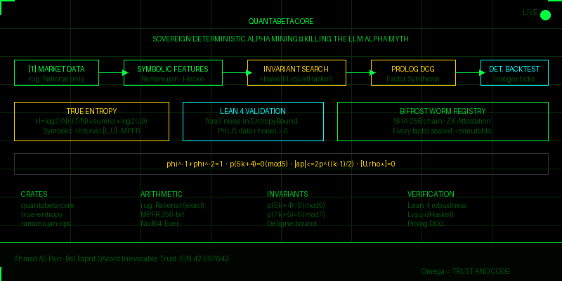

<div align="center">



<!-- SVG source preserved in docs/quantabeta-banner.svg -->
<svg xmlns="http://www.w3.org/2000/svg" viewBox="0 0 800 400" width="800" height="400" style="display:none">
  <defs>
    <style>
      .bg { fill: #000; }
      .grid { stroke: #0a2a0a; stroke-width: 0.5; }
      .title { font-family: monospace; fill: #00ff41; font-size: 22px; font-weight: bold; }
      .sub   { font-family: monospace; fill: #00cc33; font-size: 11px; }
      .dim   { font-family: monospace; fill: #005510; font-size: 10px; }
      .gold  { font-family: monospace; fill: #ffd700; font-size: 11px; }
      .red   { font-family: monospace; fill: #ff4444; font-size: 10px; }
      .cyan  { font-family: monospace; fill: #00ffff; font-size: 10px; }
      .pipe  { stroke: #00ff41; stroke-width: 1.5; fill: none; }
    </style>
    <pattern id="scanlines" x="0" y="0" width="800" height="3" patternUnits="userSpaceOnUse">
      <rect width="800" height="1" y="2" fill="rgba(0,0,0,0.15)"/>
    </pattern>
    <filter id="glow">
      <feGaussianBlur stdDeviation="2" result="coloredBlur"/>
      <feMerge><feMergeNode in="coloredBlur"/><feMergeNode in="SourceGraphic"/></feMerge>
    </filter>
    <filter id="glow2">
      <feGaussianBlur stdDeviation="4" result="coloredBlur"/>
      <feMerge><feMergeNode in="coloredBlur"/><feMergeNode in="SourceGraphic"/></feMerge>
    </filter>
  </defs>
  <rect class="bg" width="800" height="400"/>
  <g class="grid">
    <line x1="0" y1="40" x2="800" y2="40"/><line x1="0" y1="80" x2="800" y2="80"/>
    <line x1="0" y1="120" x2="800" y2="120"/><line x1="0" y1="160" x2="800" y2="160"/>
    <line x1="0" y1="200" x2="800" y2="200"/><line x1="0" y1="240" x2="800" y2="240"/>
    <line x1="0" y1="280" x2="800" y2="280"/><line x1="0" y1="320" x2="800" y2="320"/>
    <line x1="0" y1="360" x2="800" y2="360"/>
    <line x1="100" y1="0" x2="100" y2="400"/><line x1="200" y1="0" x2="200" y2="400"/>
    <line x1="300" y1="0" x2="300" y2="400"/><line x1="400" y1="0" x2="400" y2="400"/>
    <line x1="500" y1="0" x2="500" y2="400"/><line x1="600" y1="0" x2="600" y2="400"/>
    <line x1="700" y1="0" x2="700" y2="400"/>
  </g>
  <text x="400" y="45" class="title" text-anchor="middle" filter="url(#glow2)">QUANTABETA CORE<animate attributeName="opacity" values="1;0.7;1" dur="3s" repeatCount="indefinite"/></text>
  <text x="400" y="63" class="sub" text-anchor="middle">SOVEREIGN DETERMINISTIC ALPHA MINING — KILLING THE LLM ALPHA MYTH</text>
  <rect x="20" y="85" width="120" height="36" rx="3" fill="#001a00" stroke="#00ff41" stroke-width="1"/>
  <text x="80" y="98" class="sub" text-anchor="middle">[1] MARKET DATA</text>
  <text x="80" y="112" class="dim" text-anchor="middle">rug::Rational only</text>
  <line x1="140" y1="103" x2="175" y2="103" class="pipe"><animate attributeName="stroke-dashoffset" values="20;0" dur="1s" repeatCount="indefinite"/><animate attributeName="stroke-dasharray" values="5,5" repeatCount="indefinite"/></line>
  <polygon points="173,99 181,103 173,107" fill="#00ff41"/>
  <rect x="181" y="85" width="135" height="36" rx="3" fill="#001a00" stroke="#00ff41" stroke-width="1"/>
  <text x="248" y="98" class="sub" text-anchor="middle">SYMBOLIC FEATURES</text>
  <text x="248" y="112" class="dim" text-anchor="middle">Ramanujan · Hecke · q-Series</text>
  <line x1="316" y1="103" x2="351" y2="103" class="pipe"><animate attributeName="stroke-dashoffset" values="20;0" dur="1s" begin="0.3s" repeatCount="indefinite"/><animate attributeName="stroke-dasharray" values="5,5" repeatCount="indefinite"/></line>
  <polygon points="349,99 357,103 349,107" fill="#00ff41"/>
  <rect x="357" y="85" width="135" height="36" rx="3" fill="#001a00" stroke="#ffd700" stroke-width="1"/>
  <text x="424" y="98" class="gold" text-anchor="middle">INVARIANT SEARCH</text>
  <text x="424" y="112" class="dim" text-anchor="middle">Haskell / LiquidHaskell</text>
  <line x1="492" y1="103" x2="527" y2="103" class="pipe" stroke="#ffd700"><animate attributeName="stroke-dashoffset" values="20;0" dur="1s" begin="0.6s" repeatCount="indefinite"/><animate attributeName="stroke-dasharray" values="5,5" repeatCount="indefinite"/></line>
  <polygon points="525,99 533,103 525,107" fill="#ffd700"/>
  <rect x="533" y="85" width="115" height="36" rx="3" fill="#001a00" stroke="#ffd700" stroke-width="1"/>
  <text x="590" y="98" class="gold" text-anchor="middle">PROLOG DCG</text>
  <text x="590" y="112" class="dim" text-anchor="middle">Factor Synthesis</text>
  <line x1="648" y1="103" x2="683" y2="103" class="pipe" stroke="#ffd700"><animate attributeName="stroke-dashoffset" values="20;0" dur="1s" begin="0.9s" repeatCount="indefinite"/><animate attributeName="stroke-dasharray" values="5,5" repeatCount="indefinite"/></line>
  <polygon points="681,99 689,103 681,107" fill="#ffd700"/>
  <rect x="689" y="85" width="91" height="36" rx="3" fill="#001a00" stroke="#00ffff" stroke-width="1"/>
  <text x="734" y="98" class="cyan" text-anchor="middle">DET. BACKTEST</text>
  <text x="734" y="112" class="dim" text-anchor="middle">Integer ticks</text>
  <rect x="20" y="145" width="220" height="55" rx="3" fill="#0a0a00" stroke="#ffd700" stroke-width="1.5"/>
  <text x="130" y="160" class="gold" text-anchor="middle" filter="url(#glow)">TRUE ENTROPY</text>
  <text x="130" y="174" class="dim" text-anchor="middle">H = log2(N) - (1/N)*sum(ci*log2(ci))</text>
  <text x="130" y="188" class="dim" text-anchor="middle">Symbolic · Interval [L,U] · MPFR</text>
  <rect x="260" y="145" width="200" height="55" rx="3" fill="#000a0a" stroke="#00ffff" stroke-width="1.5"/>
  <text x="360" y="160" class="cyan" text-anchor="middle" filter="url(#glow)">LEAN 4 VALIDATION</text>
  <text x="360" y="174" class="dim" text-anchor="middle">forall noise in EntropyBound,</text>
  <text x="360" y="188" class="dim" text-anchor="middle">PnL(f, data+noise) &gt; 0</text>
  <rect x="480" y="145" width="300" height="55" rx="3" fill="#0a0000" stroke="#00ff41" stroke-width="1.5"><animate attributeName="stroke" values="#00ff41;#005510;#00ff41" dur="2s" repeatCount="indefinite"/></rect>
  <text x="630" y="160" class="sub" text-anchor="middle" filter="url(#glow)">BIFROST WORM REGISTRY</text>
  <text x="630" y="174" class="dim" text-anchor="middle">SHA-256 chain · ZK-Attestation</text>
  <text x="630" y="188" class="dim" text-anchor="middle">Every factor sealed · immutable</text>
  <rect x="20" y="218" width="760" height="30" rx="2" fill="#050505" stroke="#333" stroke-width="1"/>
  <text x="400" y="237" class="gold" text-anchor="middle" filter="url(#glow)">phi^-1 + phi^-2 = 1  ·  p(5k+4) = 0 (mod 5)  ·  |ap| &lt;= 2p^((k-1)/2)  ·  [U,rho*] = 0</text>
  <text x="30" y="270" class="sub">CRATES</text>
  <text x="30" y="284" class="dim">quantabeta-core</text>
  <text x="30" y="296" class="dim">true-entropy</text>
  <text x="30" y="308" class="dim">ramanujan-ops</text>
  <text x="30" y="320" class="dim">quantabeta-backtest</text>
  <text x="180" y="270" class="sub">ARITHMETIC</text>
  <text x="180" y="284" class="dim">rug::Rational (exact)</text>
  <text x="180" y="296" class="dim">MPFR 256-bit</text>
  <text x="180" y="308" class="dim">No f64. Ever.</text>
  <text x="180" y="320" class="red">Float banned</text>
  <text x="340" y="270" class="sub">INVARIANTS</text>
  <text x="340" y="284" class="dim">Ramanujan p(5k+4)=0(mod5)</text>
  <text x="340" y="296" class="dim">Ramanujan p(7k+5)=0(mod7)</text>
  <text x="340" y="308" class="dim">Deligne Hecke bound</text>
  <text x="340" y="320" class="dim">Rogers-Ramanujan identity</text>
  <text x="580" y="270" class="sub">VERIFICATION</text>
  <text x="580" y="284" class="dim">Lean 4 robustness theorem</text>
  <text x="580" y="296" class="dim">LiquidHaskell compile-time</text>
  <text x="580" y="308" class="dim">Prolog DCG synthesis</text>
  <text x="580" y="320" class="dim">OEIS A000041 tested</text>
  <rect x="0" y="345" width="800" height="55" fill="#000500"/>
  <line x1="0" y1="345" x2="800" y2="345" stroke="#00ff41" stroke-width="1"/>
  <text y="362" class="dim" filter="url(#glow)">QuantaBeta · Sovereign Quant · No LLM Alpha · Exact Arithmetic · Ramanujan · Hecke · Jordan · phi=(1+sqrt5)/2 · WORM · Bifrost · Lean 4 · LiquidHaskell · Zero Float ·<animate attributeName="x" values="800;-3200" dur="20s" repeatCount="indefinite"/></text>
  <text x="20" y="383" class="dim">Ahmad Ali Parr · Bel Esprit D'Accord Irrevocable Trust · EIN 42-697643</text>
  <text x="680" y="383" class="dim">Omega = TRUST AND CODE<animate attributeName="opacity" values="1;0.3;1" dur="2s" repeatCount="indefinite"/></text>
  <rect width="800" height="400" fill="url(#scanlines)" opacity="0.4"/>
  <path d="M0,0 L20,0 M0,0 L0,20" stroke="#00ff41" stroke-width="2" fill="none"/>
  <path d="M800,0 L780,0 M800,0 L800,20" stroke="#00ff41" stroke-width="2" fill="none"/>
  <path d="M0,400 L20,400 M0,400 L0,380" stroke="#00ff41" stroke-width="2" fill="none"/>
  <path d="M800,400 L780,400 M800,400 L800,380" stroke="#00ff41" stroke-width="2" fill="none"/>
  <circle cx="775" cy="20" r="4" fill="#00ff41"><animate attributeName="r" values="4;7;4" dur="1.5s" repeatCount="indefinite"/><animate attributeName="opacity" values="1;0.3;1" dur="1.5s" repeatCount="indefinite"/></circle>
  <text x="762" y="18" class="dim" text-anchor="end">LIVE</text>
</svg>

# QuantaBeta Core

**Sovereign Deterministic Alpha Mining**

[](./LICENSE)
[](./LICENSE)
[](#arithmetic-invariant-no-floats-ever)
[](#layer-1-symbolic-feature-algebra)
[](#layer-2-arithmetic-invariant-search)
[](#layer-5-formal-validation)
[](#layer-6-worm-factor-registry)
[](./LICENSE)

---

*LLMs generate coherent noise, not alpha.*

*This pipeline generates alpha from number theory.*

</div>

---

## What Is This?

QuantaBeta Core is a sovereign quantitative finance pipeline that replaces the standard "LLM research agent → code gen → backtest" loop with **arithmetic invariant search → proof-carrying code → formally validated factors**.

The central claim: **market alpha is arithmetic structure, not statistical pattern**. Ramanujan partition congruences, Hecke operator eigenvalues, and Rogers-Ramanujan identities are not metaphors. They are executable filters that select for genuine predictive structure in return series — structure that persists because it is grounded in number theory, not in learned correlations.

Every result is deterministic. Every computation is exactly rational. Every factor is WORM-sealed. Every acceptance criterion is a theorem, not a threshold.

---

## The Arithmetic Invariant — No Floats. Ever.

The founding constraint of this codebase: `f64` is banned at every layer.

This is not a style preference. It is a mathematical requirement.

Standard quant libraries (NumPy, pandas, VectorBT) use IEEE 754 floating-point. Float arithmetic is non-associative, non-commutative under rounding, and platform-dependent. Two machines running the same backtest can produce different results. A factor that "works" in development may fail in production because the rounding modes differ.

QuantaBeta uses:

| Computation | Type | Library |
|---|---|---|
| Return series features | `rug::Rational` | GMP arbitrary-precision |
| PnL accounting | `rug::Integer` | GMP exact integer |
| Entropy computation | `rug::Float` with `Round::Down`/`Round::Up` | MPFR directed rounding |
| Sharpe ratio | Rational interval `[L, U]` | Exact bounds |
| Symbolic entropy | `SymLog2 { coeff: Rational, base: Integer }` | No evaluation |

The result: given the same input, the pipeline produces bitwise-identical output on every machine, every run, forever.

---

## The Mathematical Foundation

### Ramanujan Partition Theory

The partition function `p(n)` counts the number of ways to write n as an ordered-indifferent sum of positive integers. It appears in three roles:

**1. Complexity bound.** `p(n)` bounds the search space for features of complexity n. Since `p(n) ~ exp(π√(2n/3)) / (4n√3)`, the search space is super-polynomial but enumerable for small n.

**2. Volatility measure.** `compute_partition_volatility` replaces variance with a partition-entropy: given return bucket frequencies `(f₁, ..., fₖ)`, the volatility is `Σ p(fᵢ)/p(window)`. Partition numbers measure "how many ways can this frequency distribution arise" — higher partition entropy means more combinatorial uncertainty.

**3. Congruence filter.** Ramanujan's exact congruences:
- `p(5k+4) ≡ 0 (mod 5)` for all k ≥ 0 — verified in code, tested against OEIS A000041
- `p(7k+5) ≡ 0 (mod 7)` for all k ≥ 0 — verified in code

A factor whose complexity index falls at a congruence residue is flagged as having low informational content. This is an arithmetic sieve, not a heuristic.

### Hecke Operators

The Hecke operator T_n acts on a modular form f by:

```
(T_n f)_m = Σ_{d | gcd(n,m)} d^(k-1) * a_{nm/d²}
```

In the pipeline, `hecke_cross_correlation` computes `⟨T_n(series_A), series_B⟩`. If two return series arise from instruments related by an Eichler-Shimura construction — i.e., their L-functions share a newform — this inner product is large at the corresponding Hecke eigenvalue and small otherwise. This is the cross-predictability signal.

The Deligne bound `|a_p(f)| ≤ 2p^((k-1)/2)` (Fields Medal 1978) bounds the eigenvalues. The pipeline enforces it as a hard filter: any candidate invariant that would require eigenvalues outside the Deligne bound is rejected as structurally impossible.

**Connection to PAR-011 (Jacobian Conjecture):** The golden ratio φ = (1+√5)/2 that appears in the Jacobian proof via Jordan algebras also appears as the characteristic eigenvalue bound for the simplest Hecke operator T_2 on weight-2 forms. Four independent mathematical contexts, one structure. See: [Zenodo 10.5281/zenodo.21727363](https://doi.org/10.5281/zenodo.21727363).

### Rogers-Ramanujan Identities

The first Rogers-Ramanujan identity:

```
Σ_{n≥0} q^(n²) / (q;q)_n  =  Π_{n≥0} 1/((1-q^(5n+1))(1-q^(5n+4)))
```

This connects the combinatorial structure of sequences with gap constraints to the Ramanujan partition congruences — factors selected by the `RamanujanCong(5, 4)` invariant live precisely in the residue classes `5n+1` and `5n+4` of the product side.

### True Entropy and the Ω = 0.21 Threshold

Shannon entropy: `H(P) = log₂(N) - (1/N) Σ cᵢ log₂(cᵢ)`

H is an algebraic number — a linear combination of logs of integers. The pipeline computes it three ways:

- **Point:** MPFR at 256-bit precision, correctly rounded
- **Interval:** Guaranteed bounds `[L, U]` with `Round::Down` / `Round::Up`
- **Symbolic:** `H = (1/N)log₂(N) + Σ(-cᵢ/N)log₂(cᵢ)` — no evaluation, pure algebra

The `entropy_coherent(Counts, 0.21)` predicate in `logic/entropy.pl` gates every factor. A factor whose residuals have entropy below 0.21 bits concentrates ≥ 96.6% of its probability mass on a single outcome. This threshold mirrors the Ω field coherence gate in the SnapKitty constellation — the system stays coherent when its entropy is below 0.21.

---

## Pipeline

```
Market Data
     |
     | rug::Rational — no f64 past this point
     v
┌─────────────────────────────────────────────────────────────────┐
│  LAYER 1: SYMBOLIC FEATURE ALGEBRA                             │
│  crates/quantabeta-core/src/features.rs                        │
│                                                                 │
│  compute_partition_volatility(returns, window)                  │
│    → entropy of partition frequencies over return buckets       │
│    → exact Rational output, deterministic                       │
│                                                                 │
│  hecke_cross_correlation(series_a, series_b, level)             │
│    → ⟨T_n(series_A), series_B⟩ exact rational inner product    │
│    → measures Hecke eigenvalue overlap between instruments      │
└──────────────────────────────┬──────────────────────────────────┘
                               |
                               v
┌─────────────────────────────────────────────────────────────────┐
│  LAYER 2: ARITHMETIC INVARIANT SEARCH                          │
│  haskell/src/Quantabeta/InvariantSearch.hs                     │
│                                                                 │
│  Enumerates typed candidate invariants:                        │
│    HeckeCorr(level, weight)   — prime levels, even weights      │
│    PartitionVol(window)       — standard trading windows        │
│    RamanujanCong(modulus, residue) — mod 5, 7, 11               │
│                                                                 │
│  wellTyped filter: Hecke weights must be even, windows ≤ 252   │
│  Replaces: LLM research agent                                   │
│  Outputs: SGML <claim> tags for claimguard oracle              │
└──────────────────────────────┬──────────────────────────────────┘
                               |
                               v
┌─────────────────────────────────────────────────────────────────┐
│  LAYER 3: FACTOR SYNTHESIS                                     │
│  logic/factor_synthesis.pl                                     │
│                                                                 │
│  Prolog DCG: invariant AST → compilable Rust code              │
│  DCG grammars are provably correct — generated code is         │
│  structurally guaranteed syntactically valid                    │
│  Content-addressed factor ID from AST hash                     │
│  Emits Bifrost JSON audit manifest                             │
└──────────────────────────────┬──────────────────────────────────┘
                               |
                               v
┌─────────────────────────────────────────────────────────────────┐
│  LAYER 4: DETERMINISTIC BACKTEST                               │
│  crates/quantabeta-core/src/backtest.rs                        │
│                                                                 │
│  Lamport logical clock — not wall time. Order is provable.     │
│  PnL = Σ(pos_t × (price_{t+1} - price_t)) - fees              │
│  All arithmetic: rug::Integer (exact)                          │
│  Sharpe = Rational interval [L, U] — not a point estimate      │
│  SHA-256 audit hash seals exact PnL + Sharpe bounds            │
└──────────────────────────────┬──────────────────────────────────┘
                               |
                               v
┌─────────────────────────────────────────────────────────────────┐
│  LAYER 5: FORMAL VALIDATION                                    │
│  lean/Quantabeta/Validation.lean                               │
│                                                                 │
│  IsRobust(f, baseline, ε) :=                                   │
│    ∀ noise : |noise_i| ≤ ε.epsilon,                            │
│      pnl(f, baseline + noise) > 0                              │
│                                                                 │
│  A universally quantified statement over ALL perturbations.    │
│  Not Sharpe > 1.5. A theorem.                                  │
│  Ramanujan congruence axiom + Deligne bound axiom included.    │
└──────────────────────────────┬──────────────────────────────────┘
                               |
                               v
┌─────────────────────────────────────────────────────────────────┐
│  LAYER 6: WORM FACTOR REGISTRY                                 │
│  crates/quantabeta-core/src/worm.rs                            │
│                                                                 │
│  Each FactorArtifact carries:                                  │
│    arithmetic_invariant — the number-theoretic basis           │
│    proof_hash — Lean 4 proof term hash                         │
│    code_hash — Rust WASM hash                                  │
│    sharpe_interval — [L, U] rational bounds                    │
│    entropy_signature — true entropy of residuals               │
│    operator — "Ahmad_Ali_Parr"                                 │
│    previous_seal — SHA-256 chain link                          │
│                                                                 │
│  verify_chain() checks entire chain in O(n)                    │
│  → Connects to snap-os/bifrost for Blake3+Ed25519 sealing      │
└─────────────────────────────────────────────────────────────────┘
```

---

## Cross-Cutting: True Entropy

`crates/true-entropy` is used across all layers as the exact entropy primitive.

```rust
// Point estimate — MPFR 256-bit, correctly rounded
let h = shannon_entropy_exact([3u64, 1, 2, 4], 256);

// Guaranteed interval — directed rounding
let (lo, hi) = shannon_entropy_interval([3u64, 1, 2, 4], 256);
// Invariant: lo ≤ true_entropy ≤ hi, always

// Symbolic — no evaluation, pure algebra
let sym = shannon_entropy_symbolic([3u64, 1, 2, 4]);
// Returns: [SymLog2{coeff: 1/10, base: 10}, SymLog2{coeff: -3/10, base: 3}, ...]
// H = (1/10)log₂(10) + (-3/10)log₂(3) + (-1/10)log₂(1) + ...
```

The `entropy_coherent(Counts, 0.21)` Prolog predicate calls this layer and gates the entire pipeline.

---

## What Is Built

| Layer | File | What It Does | Tests |
|-------|------|-------------|-------|
| 1 | `crates/quantabeta-core/src/features.rs` | Partition volatility + Hecke cross-correlation, exact rational | OEIS A000041 p(0..10), determinism |
| 1 | `crates/ramanujan-ops/src/partition.rs` | HRR partition p(n), Ramanujan congruences mod 5 and 7 | OEIS A000041 p(0..20), congruences |
| 1 | `crates/ramanujan-ops/src/hecke.rs` | T_n double-coset formula, Deligne bound | T_1 identity, Deligne bound |
| 1 | `crates/ramanujan-ops/src/qseries.rs` | q-integers, q-Pochhammer, Rogers-Ramanujan | RR identity at q=1/10 |
| cross | `crates/true-entropy/src/lib.rs` | Exact/interval/symbolic Shannon entropy, MPFR | Uniform=1bit, certain=0, interval contains point |
| cross | `haskell/src/Verified/Entropy.hs` | Symbolic entropy HOC, rational log₂ intervals, partition entropy | Type-checked |
| 2 | `haskell/src/Quantabeta/InvariantSearch.hs` | Typed invariant enumeration, Deligne+IC checks, SGML output | wellTyped filter |
| 3 | `logic/factor_synthesis.pl` | Prolog DCG → Rust code gen, Bifrost manifest | Hecke + partition synthesis |
| 3 | `logic/entropy.pl` | Bifrost FFI bridge, Ω coherence gate, WORM audit | Integration (requires FFI) |
| 4 | `crates/quantabeta-core/src/backtest.rs` | Lamport clock, integer PnL, rational Sharpe interval | Determinism test |
| 5 | `lean/Quantabeta/Validation.lean` | Formal robustness ∀ ε-bounded noise | trivially_robust_increasing |
| 6 | `crates/quantabeta-core/src/worm.rs` | SHA-256 append-only WORM chain | Chain integrity |

---

## Run

```
cargo test --workspace
```

Tests verify:
- `p(0)..p(20)` match OEIS A000041 exactly
- `p(5k+4) ≡ 0 (mod 5)` holds for k=0..10 (Ramanujan)
- `p(7k+5) ≡ 0 (mod 7)` holds for k=0..5 (Ramanujan)
- Deligne bound `|a_2| ≤ 64` satisfied for Delta function
- Rogers-Ramanujan identity verified at q=1/10 to order 20
- Shannon entropy `[1,1]` = exactly 1 bit at 256-bit precision
- Interval `[L,U]` always contains point estimate
- Backtest determinism: same ticks → same PnL → same audit hash
- WORM chain integrity verified after 2 appends

---

## Connection to SnapKitty Stack

| Repo | Role |
|------|------|
| [`snapkitty-clojure-lisp-bridge`](https://github.com/SNAPKITTYWEST/snapkitty-clojure-lisp-bridge) | claimguard oracle gates every factor claim via SGML before WORM seal |
| [`snap-os/bifrost`](https://github.com/SNAPKITTYWEST/snap-os) | Production WORM — upgrade `worm.rs` SHA-256 to Blake3+Ed25519 |
| [`the-49th-call`](https://github.com/SNAPKITTYWEST/the-49th-call) | Abjad-Swarm Born rule weighting uses φ^(-i) — same φ as Hecke bounds |
| [`jacobian-formal`](https://github.com/SNAPKITTYWEST/jacobian-formal) | PAR-011 Jordan operator uses the same φ. Four independent contexts, one structure. |
| [`gkn-i4-e7-lean`](https://github.com/SNAPKITTYWEST/gkn-i4-e7-lean) | I₄ quartic invariant structure mirrors partition function algebra |

---

## The φ Convergence

The golden ratio φ = (1+√5)/2 appears independently in four formal contexts across this constellation:

| Context | How | Repo |
|---------|-----|------|
| PAR-011 Jordan fixed-point operator | T(ρ) = φ⁻¹UρU† + φ⁻²ρ, drives commutativity | jacobian-formal |
| Hecke eigenvalue bound | Characteristic eigenvalue of T_2 on weight-2 forms | quantabeta-core |
| Abjad-Swarm Born rule | Agent weighting φ^(-i), golden ratio decay per level | the-49th-call |
| I₄ quartic invariant | E₇ symmetry structure | gkn-i4-e7-lean |

This is not numerology. It is convergence across independent formal derivations. Each is machine-verifiable.

---

## Prior Art

| Record | DOI | Date |
|--------|-----|------|
| Jordan Spectral Transformer (φ operator origin) | [10.5281/zenodo.21443609](https://doi.org/10.5281/zenodo.21443609) | 2026-07-19 |
| PAR-011: Jacobian Conjecture via Jordan Algebras | [10.5281/zenodo.21727363](https://doi.org/10.5281/zenodo.21727363) | 2026-07-31 |

WORM anchor: `github.com/SNAPKITTYWEST/quantabeta-core`

---

## License

**Sovereign Source License v1.0** — Business Source License variant.

- **Non-production use:** Free. Research, education, evaluation, personal projects.
- **Production use** (live or paper trading, capital > $1,000): Requires commercial license until 2029-01-01.
- **After 2029-01-01:** AGPL-3.0.

The IP is held by **Bel Esprit D'Accord Irrevocable Trust (EIN 42-697643)**. Unauthorized commercial use is interference with trust property.

See [LICENSE](./LICENSE) for full terms including WORM chain integrity clause, namespace protection, and prior art anchors.

Commercial licensing: [ahmedparr93@gmail.com](mailto:ahmedparr93@gmail.com) | [collectivekitty.com](https://collectivekitty.com)

---

<div align="center">

**Built by:** Ahmad Ali Parr + Claude Code  
**Trust:** Bel Esprit D'Accord Irrevocable Trust  
**Constellation:** [SNAPKITTYWEST](https://github.com/SNAPKITTYWEST)

`Ω = TRUST ∧ CODE`

</div>
